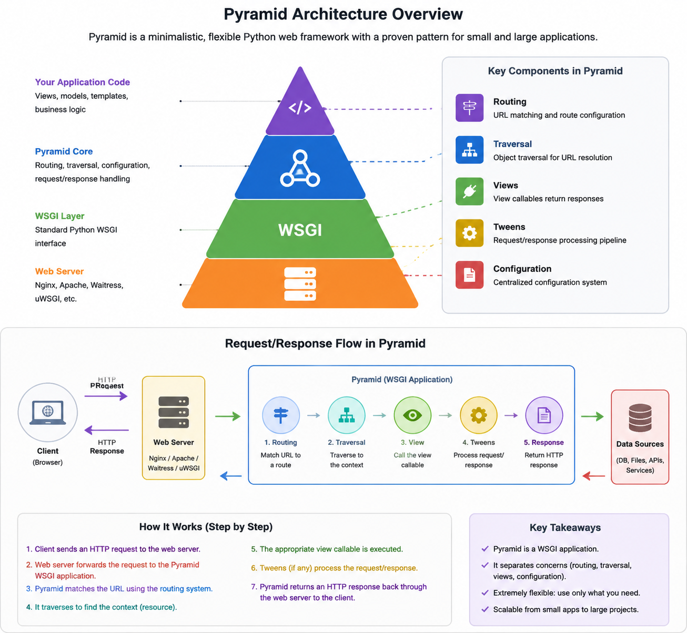
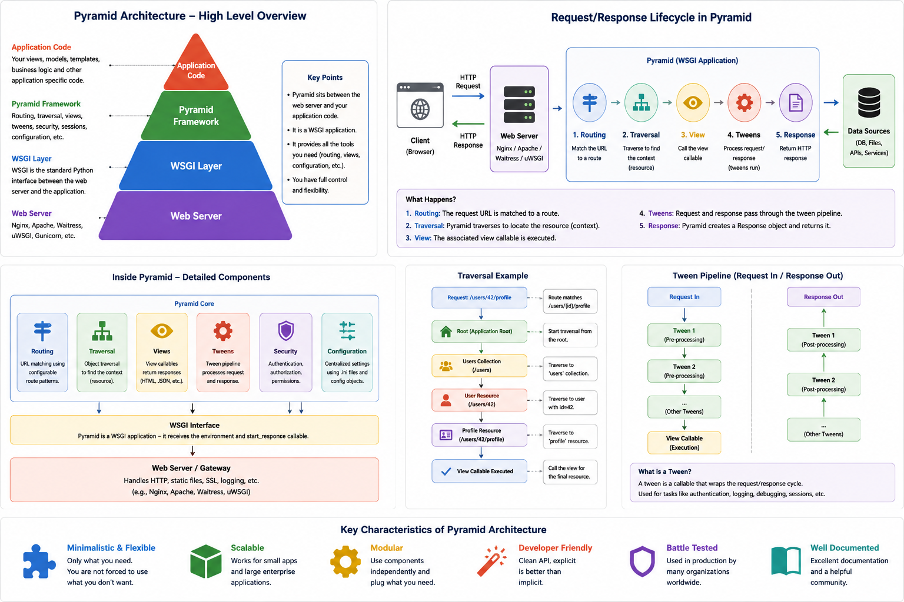
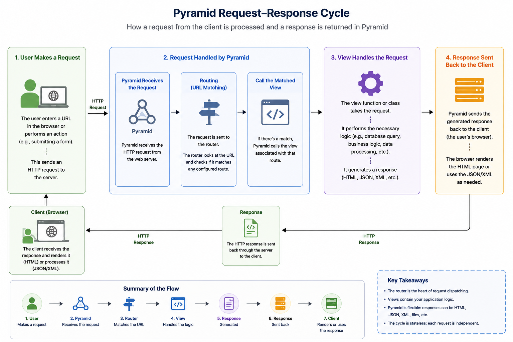

### Pyramid Architecture Overview:





Pyramid is designed to be lightweight, flexible, and modular. The core of Pyramid consists of several key components that work together to process requests and generate responses:

1. **Request**:
   - When a user accesses your web application (by entering a URL in the browser), a **request** is sent to the server. This request could be anything like a `GET` or `POST` request.
   - In Pyramid, the **request** contains all the information related to the user's action, such as:
     - HTTP method (GET, POST, etc.)
     - URL and parameters
     - Headers
     - Cookies
     - Body (in case of POST, PUT, etc.)

2. **Router**:
   - Pyramid has a **routing system** that maps incoming requests (URLs) to **views** (functions or classes that handle the request).
   - The **router** looks at the URL in the request, checks the configuration, and finds the corresponding **view**.
   - You can configure the router to match URL patterns (like `/blog/{post_id}`) and map them to specific views (functions or classes).

3. **View (Controller)**:
   - A **view** is a function or method in your application that gets called when a specific URL is requested. It processes the request, performs necessary logic, and returns a response.
   - Views are responsible for:
     - Handling input (query parameters, form data, etc.)
     - Interacting with the model (e.g., fetching data from a database)
     - Returning a response (e.g., rendering HTML, JSON data, or redirecting to another URL).

   - Views can return:
     - **HTML responses** (for web pages)
     - **JSON responses** (for APIs)
     - **Redirects**
     - **Errors (404, 500)**, etc.

4. **Response**:
   - A **response** is the final output returned to the user. After the view processes the request, it generates a response and sends it back to the browser or client.
   - Pyramid allows different types of responses:
     - **HTML** (most common for web applications)
     - **JSON** (common for APIs)
     - **Redirects** (to navigate to another page)
     - **File responses** (to serve static files)

### The Request-Response Cycle in Pyramid:



Here’s how the request-response cycle works in Pyramid:

1. **User Makes a Request**:
   - The user enters a URL in the browser or performs an action (e.g., submitting a form).
   - This sends an HTTP request to the server.

2. **Request Handled by Pyramid**:
   - Pyramid receives the request and sends it to the **router**.
   - The router looks at the URL in the request and checks if it matches any configured route.
   - If there’s a match, Pyramid calls the **view** associated with that route.

3. **View Handles the Request**:
   - The view function or class takes the request, performs the necessary logic (like querying a database, processing data, etc.), and generates a **response**.
   - This response could be HTML, JSON, or something else.

4. **Response Sent Back to the Client**:
   - Pyramid sends the generated response back to the client (the user's browser).
   - If it's an HTML page, the browser renders it. If it's JSON, the client can use it as part of an API response.

### Example Flow (Basic):

Let’s break down a very simple example where a user visits a URL (e.g., `/hello`), and Pyramid responds with "Hello, World!".

1. **User Request**:
   - The user visits the URL `http://yourwebsite.com/hello`.

2. **Routing**:
   - Pyramid checks its routing configuration and sees that the URL `/hello` is linked to a specific view.

3. **View**:
   - The view function is executed. It returns a response that says "Hello, World!".

4. **Response**:
   - Pyramid sends back an **HTML response** with the content "Hello, World!".

### Example Configuration:

In Pyramid, routing and views are configured in a Python script called **`views.py`** or in the main **`__init__.py`** file (depending on how you structure your app).

```python
from pyramid.config import Configurator
from pyramid.response import Response

# This is a simple view function
def hello_view(request):
    return Response('Hello, World!')

# Setting up the Pyramid application and routing
def main(global_config, **settings):
    config = Configurator(settings=settings)
    config.add_route('hello', '/hello')  # Map the URL '/hello' to hello_view
    config.add_view(hello_view, route_name='hello')  # Connect the view to the route
    return config.make_wsgi_app()
```

- **Configuring Routes**: `config.add_route('hello', '/hello')` defines the URL `/hello`.
- **Mapping Views**: `config.add_view(hello_view, route_name='hello')` connects the view function `hello_view` to the `/hello` route.

### Summary:

- **Request**: The user sends a request (e.g., visiting a URL).
- **Router**: The router matches the request URL to a view.
- **View**: The view processes the request and generates a response.
- **Response**: The response is sent back to the user (browser).

---
